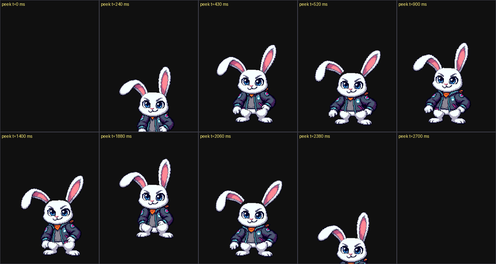
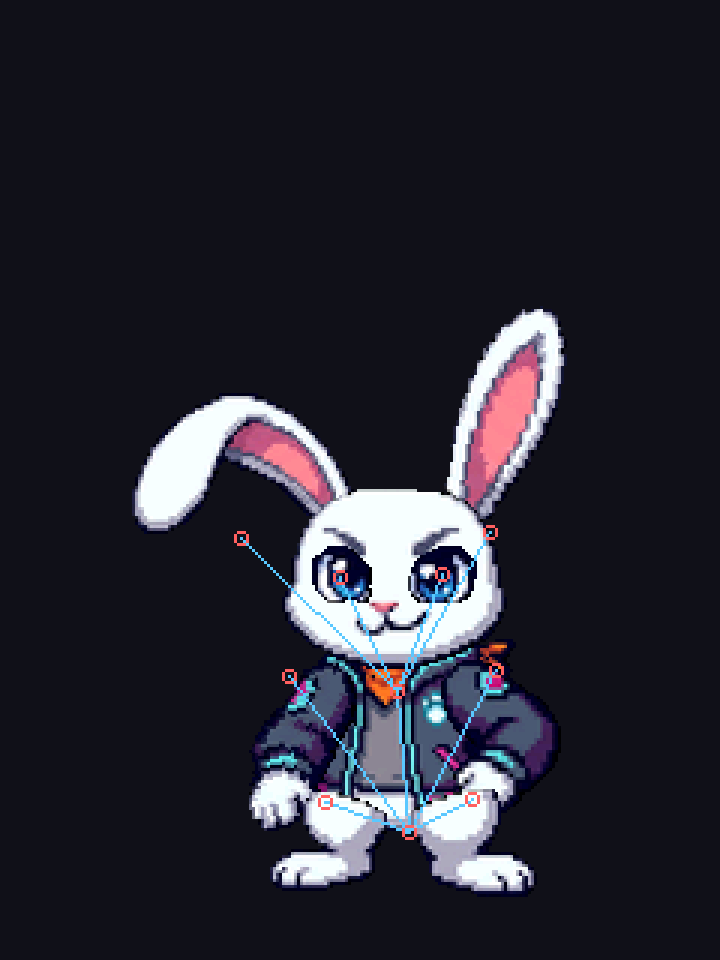
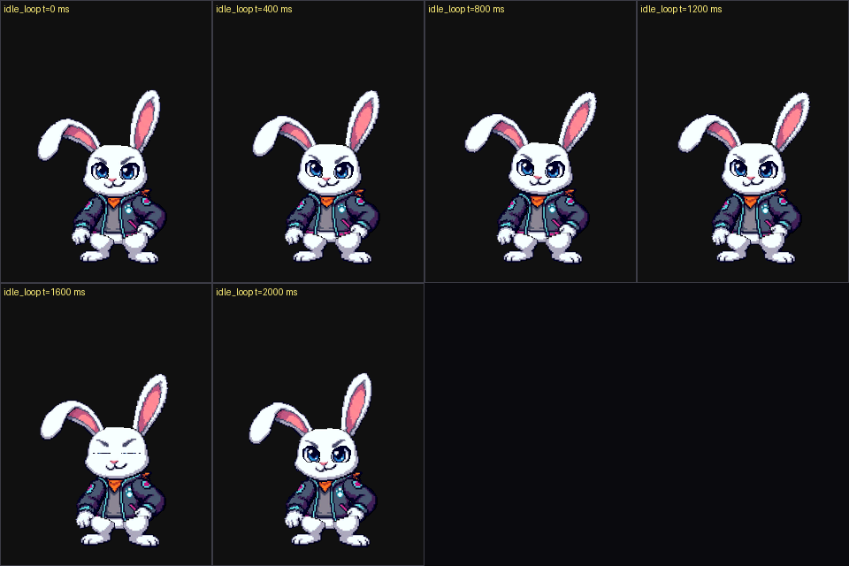

# Intellar-Engine-Animation

Public demo of **bone animation** (skeleton + cut-out parts) for Intellar-Engine:
a **rabbit3** pixel-art character, rigged and animated, played on the **ILI9341
240x320** panel (the portrait format of the robot).



*`peek`: the rabbit is off-frame, springs out, looks left then right, hops in
place and dives back. Frames rendered from the `assets/rabbit3.iska` binary by
`tools/iska_preview.py`.*

| | |
| :--- | :--- |
| Animations | `idle_loop` (breathing, loop) + `peek` (one-shot) |
| Rig | 11 bones, 10 parts, 60 kB self-contained binary |
| Engine | C++17 without dependency: loading + rendering into an RGB565 framebuffer |
| Chain | Blender -> JSON -> `.iska` (Python/Pillow), fully reproducible |
| License | MIT (code) -- see `NOTICE.md` for third parties |

## Quick start

The whole pipeline, in order, from a Blender file to something moving on your
screen. Every command runs from the repository root with `python` (3.10+,
`pip install pillow`). Blender is needed only for the steps that touch the `.blend`.

### A new character, start to finish

1. **Sprites** -- in Blender, one plane per part (`Add > Image > Images as Planes`).
   **The object name is the bone name** (`torso`, `head`, `earL`...); put each plane
   at the Z of its draw order (larger = in front). Save `tools/source/<id>.blend`.
2. **Scaffold** -- writes the rig seeds and an animation template:

   ```
   python tools/new_character.py mybot --parts torso,head,armL,armR,footL,footR
   ```

3. **Seed the skeleton** -- the seeds become an armature, saved as `<id>_rig.blend`:

   ```
   python tools/open_blender.py --id mybot planes --script blender_make_rig.py -- `
       --bones tools/rigs/mybot_bones.json --out tools/source/mybot_rig.blend
   ```

4. **Align the joints** -- the only hand work. Edit mode, `G` moves a bone, and the
   **head is the pivot** of the part:

   ```
   python tools/open_blender.py --id mybot rig
   ```

   `Ctrl+S` when done.

5. **Back to Python** -- computes the runtime rig in screen pixels (+ a control PNG
   to check the joints):

   ```
   python tools/build_asset.py --id mybot --rig-from-blender
   ```

6. **Animate** -- edit `tools/anims_mybot.py` (deltas in screen pixels / degrees),
   then pack:

   ```
   python tools/build_asset.py --id mybot --anims-from-python
   ```

   (To key the animation in Blender instead, see *Editing the animations in
   Blender*.)

7. **See it** -- a live window, or a contact-sheet PNG. No C++ executable needed:

   ```
   python tools/iska_view.py assets/mybot.iska
   python tools/iska_preview.py assets/mybot.iska --anim idle_loop --frames 8 `
       --out build/mybot/preview.png
   ```

### Tuning the shipped `rabbit3`

All seven steps above are already done (files: `tools/source/rabbit3*.blend`,
`tools/rigs/rabbit3*.json`, `tools/anims_rabbit3.py`). To retune it:

```
python tools/open_blender.py rig                 # move the joints, then Ctrl+S
python tools/build_asset.py --rig-from-blender   # joints -> rig + preview
python tools/build_asset.py --anims-from-python  # if you edited tools/anims_rabbit3.py
python tools/iska_view.py                        # look at it
```

The long form of the seven steps is *Your own sprites: planes -> bones -> first
animation*; the command reference below is the *Cheat sheet*.

### The AI-assisted loop (one id, five commands)

Everything is keyed off a single id (`mybot` below), so "generate, look, retouch" is:

```
python tools/build_asset.py --id mybot --anims-from-python   # 1. pack what tools/anims_mybot.py says
python tools/iska_view.py assets/mybot.iska                  # 2. look at it
python tools/build_asset.py --id mybot --to-blender          # 3. JSON -> Blender actions
python tools/open_blender.py --id mybot anim                 # 4. retouch, then Ctrl+S
python tools/build_asset.py --id mybot --anims-from-blender  # 5. Blender -> JSON -> asset
```

`tools/anims_mybot.py` is just code, so an LLM (Cline, DeepSeek, ...) can write step 1
for you: feed it the bone names from `tools/rigs/mybot.json`, the pose conventions at
the top of `tools/anims_rabbit3.py`, and the motion you want. `--anims-from-python`
validates it against the rig, so a wrong bone name or a loop that does not join fails
loudly instead of looking broken.

One decision to make: the `.py` and the Blender actions are **two sources of truth**.
After step 5 the JSON comes from Blender (a sparse re-bake -- same poses, more keys --
and `build_asset` reports the size change as expected, not a failure); running
`--anims-from-python` after that would overwrite those edits. Pick one and stick to it
(see *Editing the animations in Blender*).

## Cheat sheet

Every command below is run **from the root of the repository**, with `python`
(3.10+, `pip install pillow` -- on Windows use `python`, since `python3` is the
Store stub). Blender is only needed to touch the rig, PlatformIO only to flash the
robot. Not sure what a tool takes? `python tools/<tool>.py --help`.

| I want to... | Command |
| :--- | :--- |
| watch the shipped asset, right now | `python tools/iska_view.py` |
| inspect one animation (looping, slow motion) | `python tools/iska_view.py --anim peek --loop --speed 0.25` |
| render frames with no screen (CI, no window) | `python tools/iska_view.py --selftest 6 --out build/rabbit3/view.png` |
| know exactly where every joint is | `python tools/iska_view.py --pose 1440` |
| adjust the joints of the character | `python tools/open_blender.py rig` |
| push the adjusted joints into the engine | `python tools/build_asset.py --rig-from-blender` |
| place/adjust the sprites of the planes | `python tools/open_blender.py planes` |
| edit the animations in Blender | `python tools/open_blender.py anim` |
| run a Blender-side tool by hand | `python tools/open_blender.py planes --script blender_make_rig.py -- --bones tools/rigs/rabbit3_bones.json --out tools/source/rabbit3_rig.blend` |
| get the options of any tool | `python tools/<tool>.py --help` |
| scaffold a new character (seeds + template) | `python tools/new_character.py <id> --parts ...` |
| rebuild the asset (no Blender needed) | `python tools/build_asset.py` |
| rebuild the animations from Python | `python tools/build_asset.py --anims-from-python` |
| prove C++ and Python draw the same | `python tools/build_asset.py --check` |
| check the Blender round trip | `python tools/anim_roundtrip.py` |
| render a contact-sheet PNG (no window) | `python tools/iska_preview.py assets/rabbit3.iska --anim idle_loop --out build/rabbit3/preview.png` |
| see it on the panel | `python tools/flash_esp32.py --port COM5` |

### Running the scripts

`tools/` holds two families, and the difference matters the day you run one by hand:

| Family | How you start it |
| :--- | :--- |
| `build_asset.py`, `open_blender.py`, `iska_view.py`, `anim_roundtrip.py`, `flash_esp32.py`, `iska_pack.py`, `iska_info.py`, `iska_preview.py`, `iska_clip_check.py`, `rig_build.py`, `anims_rabbit3.py`, `new_character.py` | `python tools/<name>.py [options]` -- ordinary programs, each with `--help` |
| `blender_scene_setup.py`, `blender_make_rig.py`, `blender_bind.py`, `blender_export.py`, `blender_import_anims.py`, `blender_bake_anims.py` | **inside Blender**, with `python tools/open_blender.py <scene> --script <name>.py -- <its arguments>` |

Two files are libraries rather than programs -- `iska_common.py` (format, blitter,
skeleton) and `blender_iska.py` (engine <-> Blender maths): you never run those.

The second family `import bpy`: they only exist *inside* Blender, and
`python tools/blender_make_rig.py` stops on `ModuleNotFoundError: No module named
'bpy'`. `open_blender.py --script` finds the executable, opens the right `.blend`,
skips the scene setup and gets Blender's flag order right -- it is the same as
writing, by hand:

```powershell
blender -b tools/source/rabbit3.blend --python tools/blender_make_rig.py -- `
    --bones tools/rigs/rabbit3_bones.json --out tools/source/rabbit3_rig.blend
```

(`-b` = headless, then the `.blend` to open, `--python <script>`, then `--` and the
script's own arguments.) The positional `<scene>` is simply the `.blend` you want:
`planes` (`rabbit3.blend`), `rig` (`rabbit3_rig.blend`) or `anim`
(`rabbit3_anim.blend`) -- or `--id <id>` for `tools/source/<id>.blend`,
`<id>_rig.blend` / `<id>_anim.blend`.

Running one from inside Blender works as well: `File > Open` the `.blend`, then
`Scripting > Open` the `blender_*.py`, then *Run Script*. Three things to know:

* a Text block **cannot take arguments**, so that run uses the defaults printed by
  `--help` (`--bones tools/rigs/rabbit3_bones.json`, `--out
  tools/source/rabbit3_rig.blend`...). Pass flags with the `--script` form above;
* those defaults **write** the reference files -- `tools/source/rabbit3_rig.blend`
  for `blender_make_rig.py`, `tools/source/rabbit3_anim.blend` for
  `blender_bind.py` / `blender_import_anims.py`, `tools/animations/rabbit3.json`
  for `blender_bake_anims.py`. That is what those rows do, but it is not a dry
  run: add `--out build/...` to look first;
* the paths are read from the **root of the repository**, whatever folder Blender
  was started in (a double click starts it in `C:\Program Files\Blender
  Foundation\...`, where `tools/rigs/rabbit3_bones.json` does not exist). Blender
  also reports the folder of a Text block as the `.blend` itself, so a traceback
  can read `...\tools\source\rabbit3.blend\blender_make_rig.py`: that is not a path
  on disk, just how Blender names the text.

| Blender-side script | Run it on its own |
| :--- | :--- |
| `blender_make_rig.py` | `python tools/open_blender.py planes --script blender_make_rig.py -- --bones tools/rigs/rabbit3_bones.json --out tools/source/rabbit3_rig.blend` |
| `blender_export.py` | `python tools/open_blender.py rig --script blender_export.py -- --out build/rabbit3/scene.json` |
| `blender_bind.py` | `python tools/open_blender.py rig --script blender_bind.py -- --out tools/source/rabbit3_anim.blend` |
| `blender_import_anims.py` | `python tools/open_blender.py anim --script blender_import_anims.py -- --anims tools/animations/rabbit3.json --out tools/source/rabbit3_anim.blend` |
| `blender_bake_anims.py` | `python tools/open_blender.py anim --script blender_bake_anims.py -- --rig tools/rigs/rabbit3.json --out tools/animations/rabbit3.json` |
| `blender_scene_setup.py` | nothing to type: `python tools/open_blender.py rig` runs it as the `.blend` opens |

Most of the time you do not need these: `build_asset.py` calls them in the right
order (`--rig-from-blender`, `--anims-from-blender`, `--to-blender`), and
`anim_roundtrip.py` runs the whole Blender loop by itself.

Editing the animations in Blender and coming back takes three commands:

```powershell
python tools/build_asset.py --to-blender      # JSON -> bound .blend + one action per animation
python tools/open_blender.py anim             # scrub, retouch the curves, save
python tools/build_asset.py --anims-from-blender   # actions -> JSON -> assets/rabbit3.iska
```

`python tools/anim_roundtrip.py` proves that excursion loses nothing: it does all
three steps in a temporary directory and compares the result with the reference,
value by value *and* frame by frame.

In the viewer: `space` play/pause, `left`/`right` change animation, `up`/`down`
speed, `,`/`.` step 10 ms, `[`/`]` step 100 ms, `home` back to 0, `l` loop,
`b` background (dark/white/magenta), `s` saves a PNG, *click* replays the
one-shot animation, `q` quits. `python tools/iska_view.py --help` lists the rest.

In Blender, `open_blender.py` runs `tools/blender_scene_setup.py`: bones drawn in
front of the textured planes, the view framed on the character, Pose mode, and a
report of the plane <-> bone names -- the name binding is the one thing that
fails *silently* in the chain, since a plane whose name does not match a bone
falls back on the root bone.

Keep the bone names exactly as the seeds name them: *Armature > Names > Auto-Side
Names* (and *Batch Rename* with a side) appends a `.L`/`.R` suffix to the
**selected** bones -- `armR` becomes `armR.R` -- and the engine then no longer
matches the plane `armR`, which would follow the root bone instead.
`blender_scene_setup.py`, `blender_bind.py` and `blender_export.py` all report it;
the fix is to rename the bone back (`F2` in Edit mode, or the seed name).

## What the repository shows

1. **A home-grown format, documented and tooled** ([docs/FORMAT.md](docs/FORMAT.md)):
   an `.iska` contains the skeleton, the RGB565 sprites and the animations. The
   engine needs nothing else (no Blender, no PNG, no JSON).
2. **A real-time player** (`src/Iska/`): bone hierarchy, key interpolation,
   nearest-neighbour affine blit with a magenta transparency key.
   Measured: **0.10 ms per frame** on this rabbit (2,000 frames in 208 ms, i.e.
   ~9,600 frames/s on one core, 240x320 panel cleared on every frame --
   `intellar_anim_demo --bench 2000`).
3. **Blender -> skeleton tooling** (`tools/`): the rig is placed with the mouse in
   Blender (the joints are visible), then everything else -- scale, feet line,
   pivots brought back into the image, draw order, packing -- is computed
   automatically.
4. **A cross-check**: the same render is implemented in Python and in C++, and
   `tools/iska_clip_check.py` proves that both give **byte-identical frames**
   (94 frames on `rabbit3`). A bug in one shows up immediately in the other.

## The rig at a glance



*Rest pose as seen by the engine (`tools/rig_build.py --preview`): red crosses =
joints, blue lines = bone links.*

And the idle loop (breathing + eye blink, 2.4 s):



## Optional: the C++ demo (SDL)

> You do not need the C++ demo to work with the character: `python
> tools/iska_view.py` shows the same frames in a window. Build it only to run the
> engine natively, or to compare C++ and Python (`--check`).

Prerequisites: [CMake](https://cmake.org/) 3.16+ and a C++ compiler (Visual
Studio 2022 Build Tools will do). **SDL2 is fetched automatically** at the first
configure through `FetchContent`, nothing to install.

```powershell
cmake -S . -B build -G "Visual Studio 17 2022" -A x64
cmake --build build --config Release --target intellar_anim_demo
.\build\Release\intellar_anim_demo.exe --iska assets/rabbit3.iska
```

The window opens in **720x960** (240x320 panel x 3): it is the simulated screen of
the [Intellar-Engine-Simulator](https://github.com/Intellar-Robotics/Intellar-Engine-Simulator)
repository, reused as is (see `NOTICE.md`).

| Input | Effect |
| :--- | :--- |
| *click* / *simulated touch* | plays `peek`, then goes back to `idle_loop` |
| `Esc` | quits |
| `--auto 5000` | replays `peek` every 5 s (ideal for a capture) |

### Capturing frames, without a screen or SDL

```powershell
.\build\Release\intellar_anim_demo.exe --iska assets/rabbit3.iska `
    --dump build\frames --anim all --keys
```

Every captured frame is written as a BMP (+ raw `.565`) and comes with an
**FNV-1a** fingerprint, recomputed on the Python side by `iska_clip_check.py`: it
is that shared fingerprint that guarantees the engine and the tooling look at the
same thing.

## The complete chain: Blender -> `.iska`

```
tools/source/rabbit3.blend        planes placed by hand (Images as Planes)
        |  blender_make_rig.py     adds the armature (11 bones) to the .blend
        v
tools/source/rabbit3_rig.blend    <- the skeleton is adjusted HERE, with the mouse
        |  blender_export.py       reads planes + bones -> build/rabbit3/scene.json
        v
tools/rig_build.py                scale, feet line, pivots, draw order
        v
tools/rigs/rabbit3.json           runtime rig (everything in screen pixels)
        |  anims_rabbit3.py        writes the animations (JSON, deterministic)
        v
tools/animations/rabbit3.json     poses per key, as deltas
        |  iska_pack.py            PNG -> RGB565, poses -> binary
        v
assets/rabbit3.iska               what the engine loads
```

All the commands (to be run from the root of the repository):

```powershell
# 1. starting skeleton (idempotent: rewrites the armature from the seeds)
python tools\open_blender.py planes --script blender_make_rig.py -- `
    --bones tools\rigs\rabbit3_bones.json --out tools\source\rabbit3_rig.blend

# 2. export of the Blender placement (planes + bones)
python tools\open_blender.py rig --script blender_export.py -- `
    --out build\rabbit3\scene.json

# 3. engine rig + control preview (docs/img/rabbit3_rig.png)
python tools\rig_build.py build\rabbit3\scene.json --id rabbit3 `
    --out tools\rigs\rabbit3.json --preview build\rabbit3\rig_preview.png

# 4. animations, packing, check
python tools\anims_rabbit3.py --rig tools\rigs\rabbit3.json `
    --out tools\animations\rabbit3.json
python tools\iska_pack.py --rig tools\rigs\rabbit3.json `
    --anims tools\animations\rabbit3.json --out assets\rabbit3.iska

# 5. C++ vs Python check (94 frames) -- also available as a CMake target
python tools\iska_clip_check.py --iska assets\rabbit3.iska `
    --demo build\Release\intellar_anim_demo.exe
```

### Why go through Blender for the skeleton?

Because placing a joint is **visual** work: in Blender you see the paw, the ear and
the plane, you put the bone head in the right place, then you click-parent. Once
the `.blend` is adjusted, everything else (scale, feet line, box scaling, pivots
brought back into the image, draw order taken from Z, rest angles) is **computed**,
never typed by hand:

* `blender_make_rig.py` places a starting armature automatically (the seeds of
  `tools/rigs/rabbit3_bones.json` are fractions of each plane's box): you do not
  start from a blank page;
* `blender_export.py` only **reads** the `.blend` (it writes nothing into it);
* `rig_build.py` records `"angles": "plane"`: by default the rest angle comes from
  the plane's rotation in Blender, so the render matches the original placement
  exactly. `--angles bone` uses the bone direction (useful if you straightened the
  bones to define the reference pose).

The **animations**, on the other hand, are written in Python/JSON
(`tools/anims_rabbit3.py`): a 90 ms bounce or an 80 ms blink are tuned faster in a
table than in a timeline, the result is versionable, diffable and checkable without
opening Blender. Both animations provided are generated by code: `idle_loop` is a
sum of sine waves (whose periods divide the duration, which guarantees a seamless
loop -- verified frame by frame), and `peek` is a commented table of keyframes.

## The chain in one command

```powershell
python tools/build_asset.py            # the JSON files -> assets/rabbit3.iska, verified
```

No Blender, no mouse: `tools/rigs/rabbit3.json` (the rig, in screen pixels) and
`tools/animations/rabbit3.json` (the poses) are enough to rebuild an asset that is
**byte for byte** the shipped one -- that is what the command prints, and it is the
reason the binary can be trusted without opening anything:

```
[build_asset] assets/rabbit3.iska: rebuilt **byte for byte** (61319 B, sha256 8f060f1b...)
```

It also runs `tools/iska_clip_check.py` when the demo binary is available (C++ and
Python render the 94 comparison frames identically). The other options re-read the
`.blend` (`--rig-from-blender`), regenerate the poses with `tools/anims_rabbit3.py`
(`--anims-from-python`), re-bake them from Blender (`--anims-from-blender`) or go
the other way round (`--to-blender`).

## Editing the animations in Blender

The animations live in JSON, but nothing stops you from *seeing* them in Blender and
retouching them there -- the chain goes both ways:

```
tools/animations/rabbit3.json    the poses (JSON: the reference)
        |  blender_import_anims.py   one action per animation, one key per JSON key
        v
tools/source/rabbit3_anim.blend  <- scrub, retouch the curves, save, in Blender
        |  blender_bake_anims.py     the actions -> JSON again
        v
tools/animations/rabbit3.json    the same poses: sparse keys, snapped to the wire
```

Three things make the excursion safe:

* the keys are put on the bones **through the engine's own maths**
  (`iska_common.Skeleton.resolve_bones`, driven into `pose_bone.matrix`), so what you
  see is what the panel shows -- there is no hand-written conversion to drift;
* the keys land on the **times the JSON itself keys** -- the poses the runtime
  interpolates linearly between, and nothing else -- so the Dope Sheet opens with one
  column per stored pose (`idle_loop`: 28 columns, `peek`: 20) instead of one per
  frame (241 / 271). There is a key to grab, to drag along the timeline, to delete:
  moving one is moving the animation. `--dense` writes one per 10 ms frame instead
  (the same motion, no column left to edit);
* the way back samples every 10 ms frame and writes **sparse** keys again: a key is
  dropped as soon as the linear interpolation between its neighbours reproduces every
  frame it covers within one wire step (a whole pixel, a tenth of a degree, 1/10000
  of scale), and a bone that never leaves the rest pose is not written at all.

One thing you will notice in the viewport: the planes are **stacked**, not coplanar.
Each one sits at the Z that carries the draw order `tools/rig_build.py` reads (torso
0.0, arms and feet 0.1, ears 0.2, head 0.3, eyes 0.4 -- "larger = in front"), so Blender
shows the occlusion the panel draws. That Z is a rig convention: the bake reads x/y,
angle and scale, and the `.iska` stores a *draw order*, never a Z -- moving a plane in
Z changes the preview and nothing else. A `.blend` imported before this rule existed
keeps the flat Z keyed in its actions, where `--to-blender` re-imports it correctly.

The way back is **equivalent, not identical**, and that is worth knowing before you
commit: the bake samples every 10 ms frame, and the pruning only drops what linear
interpolation already reproduces, so `tools/animations/rabbit3.json` comes back with
88 keys for `idle_loop` and 44 for `peek` where the JSON had 28 and 20 -- the same
poses, in a 69 382 B file holding 132 keys instead of 48, and a 70 727 B `.iska`
instead of 61 319 B. That is no bigger than the round trip used to cost (112 B
smaller on the `.iska`, 666 B on the JSON): the importer no longer asks Blender to
hold a key on every frame.
`python tools/build_asset.py --anims-from-blender` therefore reports that size change
*without* calling it a failure (and still runs the C++ comparison on the new asset).
The JSON/Python path stays the compact source of truth of the shipped binary: go to
Blender to look and retouch, come back and check with `python tools/anim_roundtrip.py`,
then `python tools/build_asset.py --anims-from-python` if you want the 61 kB asset
back.

And the actions are there only because `--to-blender` put them there: a `.blend` that
never went through it makes the bake stop with *no action in this .blend: import the
animations first* -- that is Blender saying the file holds no action, re-run the first
command.

`python tools/anim_roundtrip.py` runs the whole loop and reports what it costs:

```
[roundtrip]   dx  0.48000 (tolerated 1.00000)   [0 sample(s) over, worst at idle_loop t=640 ms, bone torso]
[roundtrip]   rot 0.05714 (tolerated 0.10000)   [0 sample(s) over, worst at peek t=2000 ms, bone earL]
[roundtrip] idle_loop  241 frames: worst frame t=710 ms differs on 7446 px (pose
            shifted by less than a pixel); 138 px are wrong even allowing a 1 px shift -> OK
[roundtrip] peek        271 frames: worst frame t=1910 ms differs on 5818 px (pose
            shifted by less than a pixel); 221 px are wrong even allowing a 1 px shift -> OK
```

Allowing a 1-pixel shift is the honest way to compare two renders: every stored
value is a whole pixel and a tenth of a degree, so two *valid* assets of the same
animation differ by half a pixel, and a nearest-neighbour blit turns that into
thousands of flipped texel edges. What must never happen is a part in the wrong
place; those ~140 and ~220 pixels (out of the ~13 000 the character covers) are
neighbouring shades along texel seams, not a moved part.

## Your own sprites: planes -> bones -> first animation

*The long form of the [Quick start](#quick-start) above.*

Everything above starts from `tools/source/rabbit3.blend`, a `.blend` holding nothing
but the sprite planes. Another character starts the same way, and
`blender_make_rig.py` is the only rig tool needed to give it a skeleton: it reads the
planes, drops a bone head on each of them, links them, and leaves the alignment to the
mouse. Four files, one hand-made and three generated:

| File | Comes from |
| :--- | :--- |
| `tools/source/<id>.blend` | you: one plane per part, the artwork in the material (*Images as Planes*) |
| `tools/rigs/<id>_bones.json` | the **seeds** -- which plane, where the head sits, who the parent is (`new_character.py` writes a starting point) |
| `tools/source/<id>_rig.blend` | `blender_make_rig.py`, then the heads aligned with the mouse |
| `tools/rigs/<id>.json` | `blender_export.py` + `rig_build.py`: computed, never typed |

The examples below use `mybot` as the id; `rabbit3` follows exactly the same chain.

### 1. The planes

`python tools/open_blender.py planes` -- or `--id <id> planes` for a character of your
own, since the three positions `planes`/`rig`/`anim` name the rabbit's `.blend` files.

* one mesh per part: `Add > Image > Images as Planes`. Every tool finds a plane by
  looking for an `Image Texture` node in its materials, so a quad with the artwork in
  a material works too;
* the **object name is the bone name** (`torso`, `head`, `earL`...): the engine binds a
  plane to the bone with the same exact name, and silently falls back on the root bone
  otherwise. `blender_scene_setup.py` prints the plane <-> bone report as the file
  opens, `blender_bind.py` and `blender_export.py` report it too;
* put each plane at the Z of its **draw order** (torso 0.0, arms and feet 0.1, ears
  0.2, head 0.3, eyes 0.4: the larger the Z, the more in front). `tools/rig_build.py`
  takes the draw order from that Z, and that is what keeps the planes -- and the bones
  dropped on them -- stacked instead of coplanar (see *Editing the animations in
  Blender* above);
* size and placement are free: `rig_build.py` fits the character to the panel
  (`--height-frac`, `--feet-y`, `--center`).

### 2. The seeds

`tools/rigs/rabbit3_bones.json` is the template: one entry per bone. (`python
tools/new_character.py mybot --parts ...` writes a starting file for a new character.)

```json
{"armature": "skeleton", "bone_length": 0.35, "bones": [
  {"name": "root", "parent": null,    "part": "torso", "anchor": [0.5, 0.0],  "dir": [0, 1]},
  {"name": "head", "parent": "torso", "part": "head",  "anchor": [0.5, -0.05], "dir": [0, 1]}]}
```

| Field | Meaning |
| :--- | :--- |
| `armature` | name of the armature object (default `skeleton`) |
| `bone_length` | length given to every bone, in Blender units (default 0.35) |
| `name` | bone name = plane name, the binding key |
| `part` | the plane the head is read from (matched as written, or normalized: case and separators ignored) |
| `anchor` | where on that plane, as a **fraction of its local box**: `[0, 0]` bottom-left, `[1, 1]` top-right (outside `[0, 1]` is allowed: `-0.05` = 5 % below the box) |
| `dir` | bone direction, in Blender's XY plane (y upwards): the tail is `head + dir * bone_length` |
| `parent` | bone to link to (`null` for the root) |

The engine only uses the **head** (it becomes the joint of the `.iska`): the tail gives
the rest angle, and only matters if you later ask for `rig_build.py --angles bone`.

### 3. Seed the armature

```powershell
python tools/open_blender.py --id mybot planes --script blender_make_rig.py `
    -- --bones tools/rigs/mybot_bones.json --out tools/source/mybot_rig.blend
```

It prints `[make_rig] <n> bones -> <path>`, then one line per bone
(`head=(+0.123, -0.456) parent=torso`). A bone missing from that list has no plane: the
line above it, `no plane found for bone <name> (<part>)`, names it.

Two things to know: the script **deletes and recreates** the armature named by
`armature` in the seeds, so run it on the planes file (`<id>.blend`) and never on a
`_rig.blend` already aligned by hand -- that is also how you start over from the seeds;
and it always saves to `--out`, never in place.

### 4. Aligning the bones (the only hand work)

```powershell
python tools/open_blender.py --file tools/source/mybot_rig.blend
```

The scene opens framed on the character, the bones drawn **in front of** the textured
planes with their names on them, and the plane <-> bone report in the console. The
viewport is in Pose mode: with the armature selected, `Tab` gives **Edit Mode**, the
only mode where a bone can be moved.

| I want to... | In the viewport |
| :--- | :--- |
| move a whole bone | click it, `G` (`G` then `X` or `Y` constrains to an axis), `Enter` |
| move one end only (the head = the joint) | click the small circle at that end, `G` |
| type exact coordinates | select the head or the tail, `N` (sidebar) > *Item > Transform > Head / Tail* |
| see the artwork without the bones | `H` on the armature, `Alt+H` to bring it back |
| frame everything again | `Home` |
| start over from the seeds | re-run step 3 (the armature is rebuilt from scratch) |

The head is the **pivot of the part**: put it where the paw, the ear or the eye turns,
not necessarily at the centre of the sprite. Two rules make the rig behave:

* `blender_make_rig.py` sets the parent but never **connects** the bones: moving a
  parent's tail neither drags nor rotates its children, so the heads are adjusted one
  by one, in any order;
* keep the Z of step 1 (it is the draw order): `X` and `Y` are what you align. If the
  report shows a plane with no bone of that name, rename the bone (`F2` in Edit mode)
  -- see the note on the Auto-Side Names above.

`Ctrl+S`, then read the rig back, with a control PNG to check the joints against the
artwork before animating:

```powershell
python tools/build_asset.py --id mybot --rig-from-blender
```

That one command runs `blender_export.py` (the `.blend` -> `scene.json`) then
`rig_build.py` (-> `tools/rigs/mybot.json` + the control PNG). With no animation yet it
stops after the rig with a `no animations yet` message -- step 5 is next.

### 5. The first animation

Two ways in, both landing in `tools/animations/<id>.json` -- the simplest is to
write the poses in Python (below); Blender is the visual editor.

**Key it in Blender.** Bind the planes to the bones first (out of the box a bone does
not move its plane), which also sets `inherit_scale = 'NONE'` -- the engine rule -- and
verifies the binding on the spot:

```powershell
python tools/open_blender.py --file tools/source/mybot_rig.blend `
    --script blender_bind.py -- --out tools/source/mybot_anim.blend
python tools/open_blender.py --file tools/source/mybot_anim.blend
```

Then, in Pose mode: put the playhead on a frame, pose the bones, select them all (`A`),
`I` and pick *Location* / *Rotation* / *Scale* (Pose mode also offers *Whole Character*,
which keys every bone at once), move to the next frame and pose again. One action = one
animation, and **the name of the action is the name of the animation** in the engine
(double-click it in the Action editor: Blender starts with `skeletonAction`). The bake
counts **one frame as 10 ms** and calls frame 1 `t = 0` -- 120 frames is 1200 ms -- so
count in frames rather than in seconds, and set *Output Properties > Frame Rate* to 100
if you want the timeline to read in tenths of a second as well (the `anim` scene of the
rabbit does that for you; the bake works on frames either way).

Two details the importer writes on its actions, which a hand-made action needs as well:

* a looping animation carries `iska_loop = true` and its exact length in
  `iska_duration_ms`: without them the bake reports `loop=false` and takes the action's
  frame range as the duration. The pose on the frame *after* the last one must repeat
  the first one for the loop to join up (`idle_loop` is 2400 ms, frames 1..241);
* `use_fake_user` (the *shield* icon next to the action name) so the action survives
  saving even when it is not assigned to the armature.

Both are two lines in Blender's Text editor:

```python
action = bpy.data.actions["hop"]
action["iska_loop"] = True          # 1 frame = 10 ms: 120 frames = 1200 ms
action["iska_duration_ms"] = 1200
action.use_fake_user = True
```

The way back samples every 10 ms frame and writes sparse keys again:

```powershell
python tools/build_asset.py --id mybot --anims-from-blender
```

(by hand: `python tools/open_blender.py --file tools/source/mybot_anim.blend --script
blender_bake_anims.py -- --rig tools/rigs/mybot.json --out tools/animations/mybot.json`,
with `--only hop` to bake a single action and `--dense` for one key per frame.) The
interpolation itself is free: the bake measures frames, so a Bezier ease comes back as
it looks -- with more keys than the LINEAR curves the importer writes, that is all.

**Write it in Python (simplest).** `tools/anims_rabbit3.py` is the full example and
`tools/new_character.py` writes a starting template (poses in screen pixels, deltas
against the rest pose, validated against the rig):

```powershell
python tools/build_asset.py --id mybot --anims-from-python   # -> tools/animations/mybot.json
python tools/build_asset.py --id mybot --to-blender          # the JSON -> bound .blend + actions
python tools/open_blender.py --file tools/source/mybot_anim.blend
```

`--to-blender` is what puts the actions in the file: a `.blend` that never went through
it holds none, and the bake stops with *no action in this .blend*. This route stays the
compact source of truth of the shipped asset, and `python tools/anim_roundtrip.py
--id mybot` proves the excursion into Blender loses nothing.

Finally, look at it, and compare it with the C++ engine:

```powershell
python tools/iska_view.py assets/mybot.iska        # window: space = play/pause
python tools/iska_preview.py assets/mybot.iska     # contact sheet PNG
python tools/build_asset.py --id mybot --check     # C++ vs Python (needs the demo)
```

## The tools

The plain scripts are ordinary programs (`python tools/<name>.py --help`). The ones
that `import bpy` only run **inside Blender**, through the launcher --
`python tools/open_blender.py <scene> --script <name>.py -- ...`, see
[Running the scripts](#running-the-scripts). (`blender_iska.py` is a library shared
by them, not a script to launch.)

| Script | Role |
| :--- | :--- |
| **Look at it** | |
| `tools/iska_view.py` | plays an `.iska` in a window (tkinter + Pillow: nothing to install), with `--selftest` (headless) and `--pose` (joint positions) |
| `tools/iska_info.py` | inspects an `.iska` (bones, parts, keys, sizes) |
| `tools/iska_preview.py` | renders a PNG contact sheet of an animation, without Blender or SDL |
| `tools/iska_clip_check.py` | checks the binary + invariants + **C++ renders identical to Python** |
| **From Blender** | |
| `tools/open_blender.py` | opens the right `.blend` in Blender (finds the executable), set up for joint work |
| `tools/blender_scene_setup.py` | bones drawn in front of the textured planes, Pose mode, and a report of the plane <-> bone names |
| `tools/blender_make_rig.py` | creates/refreshes the starting armature in a `.blend` |
| `tools/blender_bind.py` | binds the planes to the bones and makes Blender obey the engine's rules (scale not inherited), with a self-verification |
| `tools/blender_export.py` | exports planes + bones from the `.blend` to `scene.json` (read-only) |
| `tools/rig_build.py` | computes the runtime rig in screen pixels (+ control PNG preview) |
| **The animations** | |
| `tools/anims_rabbit3.py` | writes the two animations (deterministic JSON, validated against the rig) |
| `tools/blender_import_anims.py` | the JSON poses -> one Blender action per animation (one key per JSON key, LINEAR) |
| `tools/blender_bake_anims.py` | the actions -> a sparse, snapped animations JSON (the reverse trip) |
| `tools/anim_roundtrip.py` | proves the whole round trip (JSON -> Blender -> JSON -> pixels) |
| `tools/iska_pack.py` | PNG -> RGB565 + poses -> `assets/rabbit3.iska` (`--check` to validate without writing) |
| **Building and flashing** | |
| `tools/build_asset.py` | the whole chain in one command, with a byte-for-byte verification |
| `tools/new_character.py` | scaffolds a new character (rig seeds + animation template) |
| `tools/flash_esp32.py` | builds the asset, compiles and uploads the ESP32 firmware |
| `tools/iska_common.py` | format + blitter + skeleton, shared (Python twin of `src/Iska/`) |
| `tools/blender_iska.py` | engine <-> Blender conversions shared by the Blender scripts |

`tools/rigs/rabbit3_bones.json` (skeleton seeds), `tools/rigs/rabbit3.json`
(runtime rig) and `tools/animations/rabbit3.json` (poses) are **versioned**: the
`.iska` asset is therefore reproducible byte for byte without Blender.

## Repository structure

```
assets/rabbit3.iska        the shipped asset (60 kB, self-contained)
demo/main.cpp              SDL 240x320 window + --dump/--bench mode
docs/FORMAT.md             ISKA format v1 specification
docs/img/                  README images (generated by the tooling)
firmware/esp32/            standalone ESP32-S3 firmware: the asset on the panel
src/Iska/IskaFormat.h      format constants and structures
src/Iska/IskaLoader.*      loading + validation (CRC, invariants)
src/Iska/IskaPlayer.*      animation playback, bone hierarchy
src/Iska/IskaRender.*      RGB565 affine blit, nearest neighbour
src/Iska/library.json      what lets any host (PlatformIO, ESP-IDF, CMake) use it
third_party/lcd/           simulated ILI9341 screen (MIT, see NOTICE.md)
tools/                     Blender -> .iska chain + viewer + build/flash (Python)
tools/source/              rabbit3.blend, rabbit3_rig.blend and the PNGs of the planes
```

`tools/source/rabbit3_anim.blend` (the bound rig with the animations as actions) and
`firmware/esp32/.pio/` are **generated**: `python tools/build_asset.py --to-blender`
and `python tools/flash_esp32.py` recreate them, nothing is lost by deleting them.

## Checking the rendering

```powershell
# CMake target: build then compare C++ / Python
cmake --build build --config Release --target iska_clip_check
```

The check fails if a single byte differs, if the CRC does not match, if a bone
references a parent that comes too late, if a loop does not join up or if the
character disappears in the middle of an animation. It is the safety net that
caught, while this demo was being written, an eye blink that put the whole body
back to rest for one frame (the bug was invisible on the key fingerprints, visible
on the **frame** fingerprints).

## Optional: on the robot (ESP32-S3)

`firmware/esp32/` is a **standalone** PlatformIO project: it plays the `.iska` on
the robot's ILI9341 panel, and shares nothing with Intellar-Engine but the public
`src/Iska/` sources of this repository.

```powershell
python tools/flash_esp32.py --port COM5     # rebuilds the asset, compiles, uploads
python tools/flash_esp32.py --build-only    # compile without a board
```

* the asset is **embedded in the firmware** (`board_build.embed_files`): flashing is
  enough, there is no filesystem step, and the animation cannot get out of sync with
  the code;
* the panel is driven with the Arduino SPI directly -- no graphics library to
  download. Pins are in `firmware/esp32/src/lcd_config.h`, and the orientation can be
  changed from the command line: `--rotation 90 --dx 0 --dy 0`;
* `t` on the serial port plays the one-shot animation, `r` restarts the loop, `i`
  prints the asset summary, and the frame rate is reported once a second;
* measured on this build: **RAM 6.2 %**, **flash 11.3 %** (asset included); the
  engine costs ~0.1 ms per frame, the SPI link (~31 ms for 240x320 at 40 MHz) is the
  real limit.

Details, pins, troubleshooting: [firmware/esp32/README.md](firmware/esp32/README.md).

## Optional: reusing ISKA in any host

`src/Iska/` is a library, not a demo: it includes `<cstddef> <cstdint> <cstdio>
<cstring> <cmath> <string> <vector>` and nothing else -- no SDL, no Arduino, no
ESP32, no filesystem object model, no Rabbit. `tools/iska_generic_check.py` enforces
that line in a fraction of a second (it also refuses the name of the character
anywhere in the library), so it can guard every commit.

The whole contract is three calls:

```cpp
Iska::Asset  asset;                          // the host owns the memory
Iska::Player player;
Iska::parseAsset(blob, size, asset);         // 1. read it (a file, or an embedded blob)
player.bind(&asset);
player.play("idle_loop", true);              // 2. drive it
player.update(deltaMs);
player.render(framebuffer, background);      // 3. RGB565 pixels, in your buffer
```

Everything else belongs to the host: where the framebuffer lives (PSRAM on the
robot, an SDL texture in the demo), how time passes, what triggers a one-shot
animation, and how the pixels reach the screen. `src/Iska/library.json` exists so
that any PlatformIO project can depend on it directly:

```ini
lib_deps = symlink://<path to this repository>/src/Iska
```

## Adapting to another character

The whole thing, step by step, is the [Quick start](#quick-start) (short) or *Your
own sprites: planes -> bones -> first animation* (long). In one breath:

1. Model the planes, `python tools/new_character.py <id> --parts ...`, seed the
   armature, align the joints in Blender, then
   `python tools/build_asset.py --id <id> --rig-from-blender`. `build_asset.py`
   forwards none of `rig_build.py`'s placement flags: if the character comes out at
   the wrong size or off the panel axis, run `rig_build.py` by hand and set
   `--height-frac` (character height), `--feet-y` (feet line) and `--center` there.
2. Animate: edit `tools/anims_<id>.py` + `--anims-from-python` (or key it in
   Blender, `--anims-from-blender`).
3. `python tools/build_asset.py` must print **byte for byte**, then `python
   tools/iska_view.py` to look at it, `python tools/anim_roundtrip.py` if you edit in
   Blender, `python tools/flash_esp32.py` for the panel.

## Assumed limits

* The blit is **nearest neighbour**: no antialiasing, hence sharp pixel art; the
  scale is free but sprite rotations are not filtered.
* Angles are stored in **tenths of a degree** (+/-3276.7 deg): beyond that, a full
  rotation has to be split into several keys.
* The scale is **not inherited** by children (see `docs/FORMAT.md`): that is what
  makes squash and stretch predictable, but a "parent that grows" must be tuned
  bone by bone. In Blender this is `inherit_scale = 'NONE'` on every bone, which
  `tools/blender_bind.py` sets and verifies.
* The engine scales a part along **the part's own axes**, a Blender bone along **the
  bone's** axes. They coincide when the sprite is not rotated relative to its bone
  (`rot_z = 0` at rest): the case of every bone the shipped animations scale
  (`torso`, the eyes). A non-uniform scale on a *rotated* part (the ears, `armR`)
  would differ slightly between the two -- use a uniform scale there, or align the
  bone with the sprite.
* A baked animation is **sparse**: the keys left out are the ones whose linear
  interpolation reproduces every sampled frame within one wire step (a pixel, a
  tenth of a degree, 1/10000 of scale). Two renders of such an animation can still
  differ on a few hundred pixels out of ~13 000, because a half-pixel difference
  moves texel edges in a nearest-neighbour blit; no *part* ever ends up elsewhere
  (`tools/anim_roundtrip.py` measures both).
* The poses of an `.iska` are **all** written (no compression): ~11 bytes per bone
  per key. At this scale it is negligible (6 kB of animations for this rabbit, 26 kB
  if every 10 ms frame is written -- which `blender_bake_anims.py --dense` does).
* Blender is the **source of the rig**, and now also a place to edit the animations:
  `blender_import_anims.py` / `blender_bake_anims.py` carry the poses both ways, and
  the shapes are still written in JSON/Python for the fast, diffable edits.

## License

Code under **MIT** (`LICENSE`). The simulated screen of `third_party/lcd/` comes
from Intellar-Engine-Simulator (MIT) and is copied there verbatim. The PNGs/`.blend`
of the character belong to their author and are not covered by the license of the
code -- see **[NOTICE.md](NOTICE.md)**.
